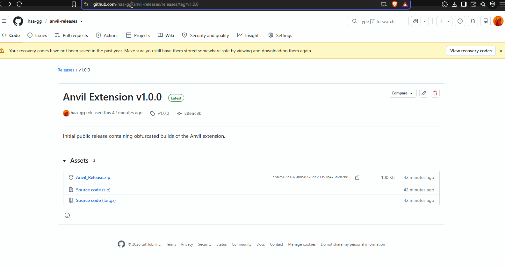
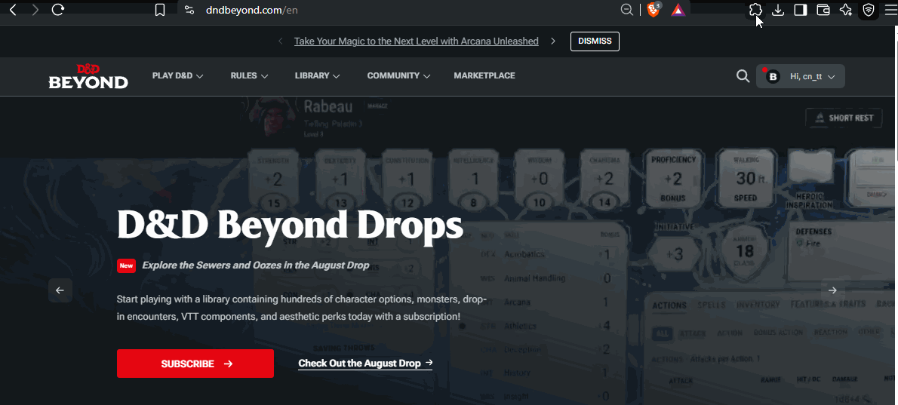
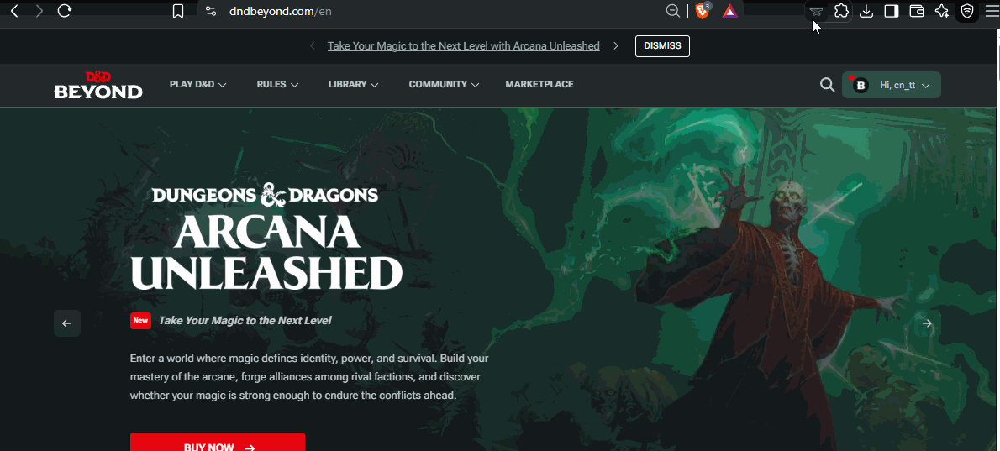

# Anvil: Magic Item Importer - User Guide

Welcome to **Anvil**, the fastest way to bring your custom homebrew magic items into D&D Beyond! Anvil acts as a bridge, automatically clicking through D&D Beyond's complex forms to build your items from plain text.

## 🚀 One-Time Initialization

Before you can import your first magic item, D&D Beyond requires a "Homebrew Subclass" to act as a hidden container for any custom spells your items might cast. Anvil automates this setup for you.

1. Download and extract the latest `Anvil_Release.zip` from the [Releases Page](https://github.com/haa-gg/anvil-releases/releases), then load it into Chrome via Developer Mode (`chrome://extensions` -> Load Unpacked).

2. Click the **Anvil icon** in your browser's toolbar. 

3. You will see a welcome screen prompting you to **Initialize Subclass**. Click the green button.

4. Anvil will automatically open a new D&D Beyond tab and generate a placeholder Artificer subclass called "Artificer - Item Abilities".
5. Do not click anything while it works! Once you see the "Subclass successfully created!" popup in the bottom right corner, you can close that tab.
6. You are now fully set up and ready to import items!

## 🪄 How to Import a Magic Item

Importing an item takes just a few seconds.

1. Navigate to the D&D Beyond homebrew creation page: `dndbeyond.com/homebrew/creations/create-magic-item` (or simply open Anvil on any DDB page and click the blue **Navigate to Magic Item Creator** button).

2. Add the **Anvil icon** in your toolbar then click it to open the importer window.

3. Paste the plain text of your magic item into the large text box. Make sure your text at least kind of follows standard 5e formatting (e.g., "Weapon (longsword), rare (requires attunement)"). You don't have to be perfect. The parser will do it's best to figure it out.
4. Click **Start Full Import**.
5. **Sit back and watch!** Anvil will take over your browser window, navigating through the various pages, adding modifiers, setting charges, and building custom spells.
6. **Important:** Do not click on the page or switch tabs while Anvil is actively importing. Let it finish its work.
7. Once the process is complete, a popup will appear saying "Import Complete!". You can now safely edit your item, add custom art, or save it to your collection!

## ⚙️ Advanced Features

- **Custom Spells:** If your magic item has a unique ability that costs charges (e.g., "As an action, you can expend 1 charge..."), Anvil will automatically build that ability as a custom spell and attach it to your item!
- **Markdown Support:** You can use standard markdown in your text (like `**bold**` or `*italics*`) and Anvil will automatically convert it into rich text for your item's description.
- **Smart Parsing:** Anvil automatically detects modifiers like `+1 bonus to AC`, `resistance to fire`, or stat overrides like `your Strength score becomes 19` and configures the item mechanics for you natively.

Enjoy bringing your homebrew worlds to life!
